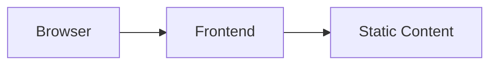

## 1. Architecture Design

## 2. Technology Description
- Frontend: React@18 + tailwindcss@3 + vite
- Initialization Tool: vite-init
- Backend: None
- Database: None

## 3. Route Definitions
| Route | Purpose |
|-------|---------|
| / | Home page with domain information and contact |

## 4. API Definitions
None

## 5. Server Architecture Diagram
None

## 6. Data Model
None